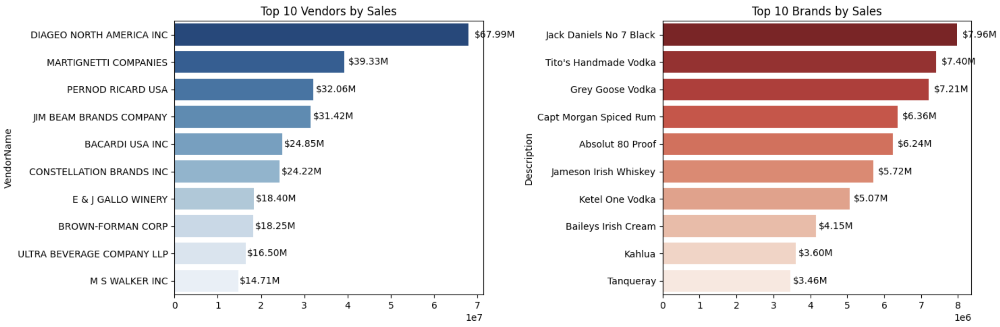
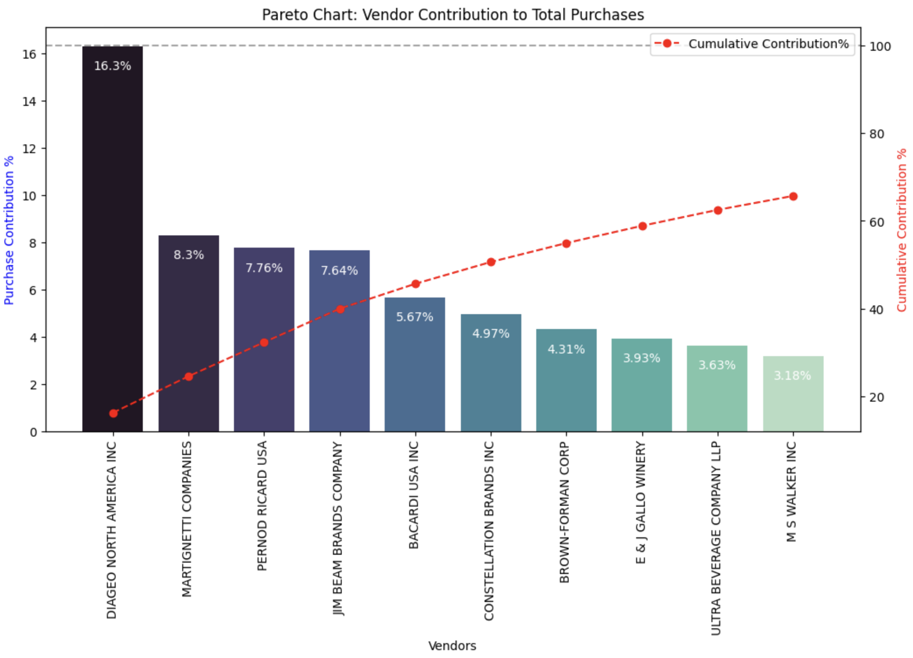
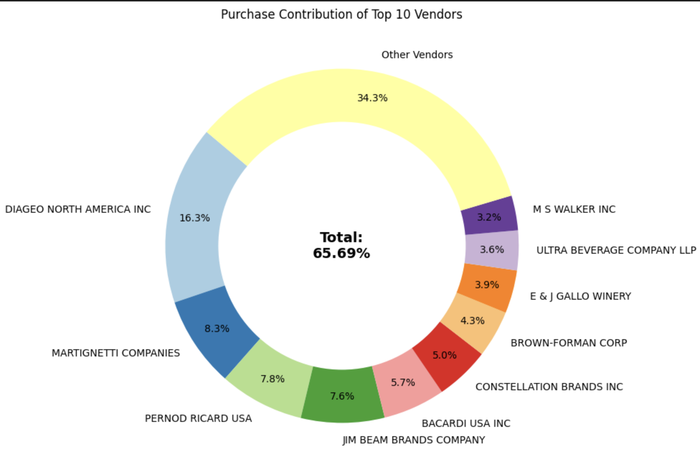
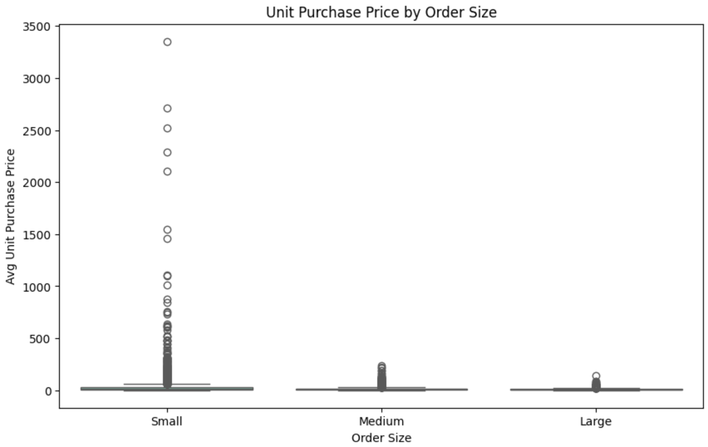
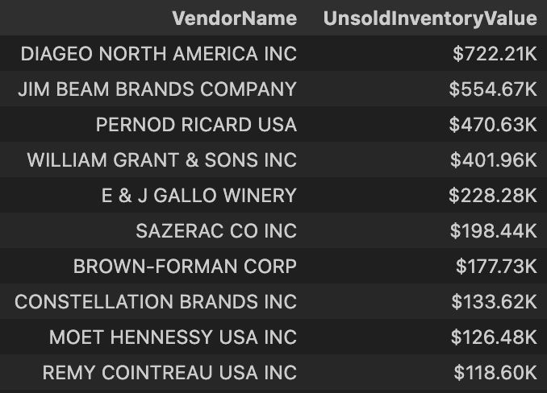
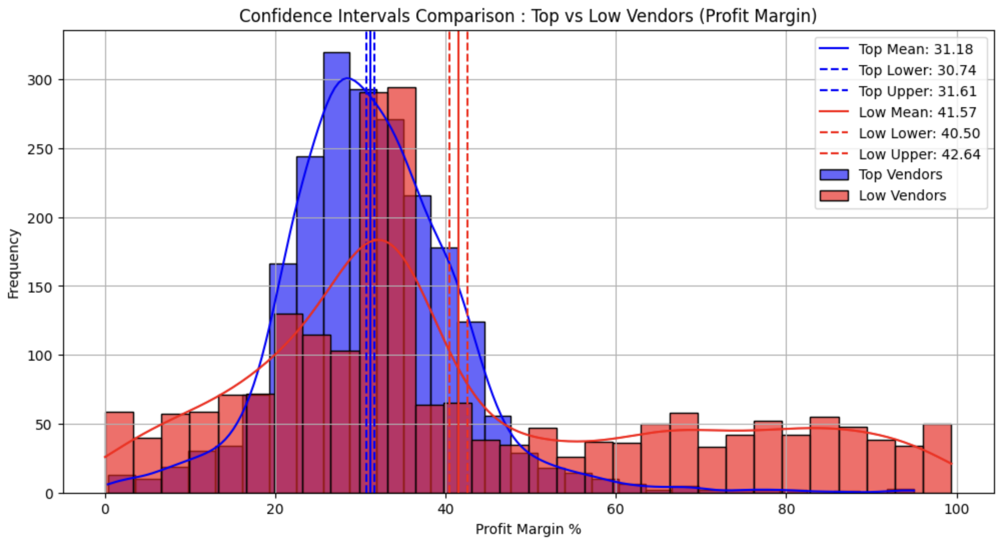

## Vendor Performance Analysis Report

### 1. Executive Summary
This analysis evaluates vendor and product performance using the consolidated `vendor_sales_summary` dataset. We focused on profitability, sales strength, purchase behavior, inventory efficiency, and vendor-level risk. The objective is to identify high-impact vendors, reveal pricing and inventory opportunities, and recommend actions for procurement and sales strategy.

---

### 2. Data Source and Preparation

#### 2.1 Data Source
- Primary source: SQLite table `vendor_sales_summary`
- Data loaded from `inventory.db` using `pandas.read_sql_query`

#### 2.2 Data Cleaning
- Filtered out records with `GrossProfit <= 0` and `TotalSalesQuantity <= 0`
- This ensured the analysis focused on transactions with positive sales activity and profit generation.

---

### 3. Exploratory Data Analysis (EDA)

#### 3.1 Summary Statistics
- Reviewed distributions, central tendency, and variance for numeric variables.
- Noted negative or zero values in sales and profit-related fields before filtering.

#### 3.2 Distributions and Outliers
- Plotted histograms and boxplots across key numeric metrics.
- Highlighted outliers in `PurchasePrice`, `ActualPrice`, `FreightCost`, and `StockTurnover`.

#### 3.3 Correlation Analysis
- Generated a correlation heatmap for numeric features.
- Key findings:
  - Very strong correlation between purchase quantity and sales quantity.
  - Weak correlation between purchase price and both sales revenue and gross profit.
  - Slight negative correlation between profit margin and total sales price.

---

### 4. Performance Segmentation

#### 4.1 Brand Opportunity Identification
- Identified brands with low sales but high profit margins.
- These brands are candidates for promotional support, pricing optimization, or distribution focus.

#### 4.2 Top Vendors and Brands by Sales
- Computed the top 10 vendors and top 10 brands by `TotalSalesDollars`.
- These rankings highlight the strongest revenue drivers.

---

### 5. Vendor Purchase Contribution

#### 5.1 Purchase Contribution Analysis
- Aggregated vendor-level `TotalPurchaseDollars`, `GrossProfit`, and `TotalSalesDollars`.
- Calculated each vendor’s percentage contribution to total purchases.

#### 5.2 Pareto and Concentration Insights
- Plotted top vendor contributions and cumulative purchase share.
- Reviewed procurement dependency on top vendors.

---

### 6. Purchase Volume vs Unit Cost

#### 6.1 Unit Purchase Price
- Derived `UnitPurchasePrice = TotalPurchaseDollars / TotalPurchaseQuantity`.
- Segmented order size into `Small`, `Medium`, and `Large` buckets.

#### 6.2 Key Finding
- Large orders show the lowest unit purchase price, confirming bulk pricing benefits.

---

### 7. Inventory Efficiency and Risk

#### 7.1 Low Inventory Turnover
- Identified vendors with `StockTurnover < 1`.
- These vendors may carry excess or slow-moving stock.

#### 7.2 Unsold Inventory Capital
- Calculated `UnsoldInventoryValue` per vendor.
- Highlighted vendors with the highest locked inventory capital.

---

### 8. Statistical Analysis

#### 8.1 Confidence Intervals
- Compared 95% confidence intervals for profit margin between top and low performing sales groups.
- Noted that low-sales vendors often have higher profit margins than top-sales vendors.

#### 8.2 Hypothesis Test
- Performed Welch’s t-test on profit margins.
- Interpreted the p-value to assess whether the margin difference is statistically significant.

---

### 9. Conclusions
- A small number of vendors drive the majority of purchase dollars.
- Bulk purchasing reduces unit cost and can improve margins if inventory is managed effectively.
- Brands with low sales and high margins are strong candidates for targeted promotion.
- Some vendors hold high value in unsold inventory, suggesting working capital pressure.
- Profitability does not always align with sales volume, so strategy should balance margin and revenue.

---

### 10. Recommendations
- Negotiate better terms with top purchase-contributing vendors.
- Address low-turnover inventory through promotions or stock reduction.
- Promote high-margin, low-sales brands with better visibility.
- Analyze demand seasonality and lead times as the next step.
